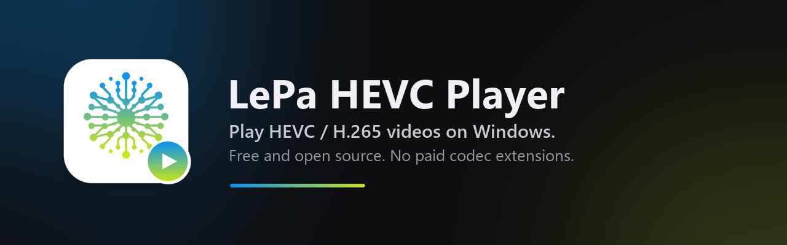
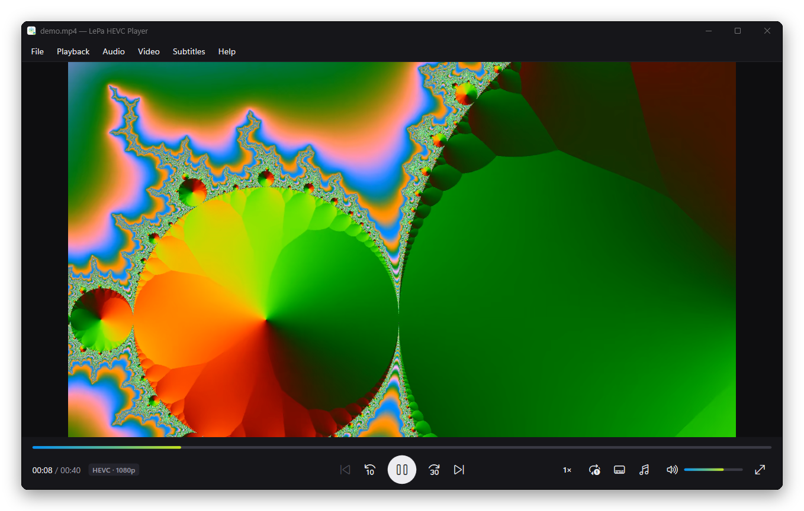
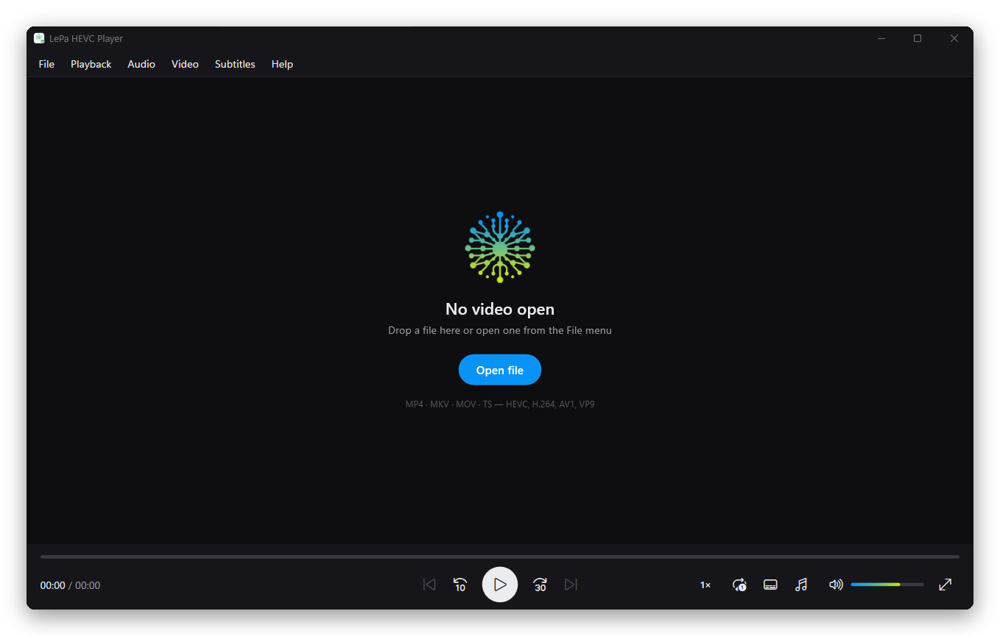

<p align="center">
  
</p>

<p align="center">
  
  
  
</p>

<p align="center">
  <a href="../../releases/latest"><b>⬇ Download for Windows</b></a>
</p>

---

## Why

Recorded a video on an iPhone, a GoPro, a drone or a modern Android phone? It's almost certainly
**HEVC (H.265)**. Open it on Windows and the built‑in apps show an error, a black screen, or a prompt to
**buy the "HEVC Video Extensions"** from the Microsoft Store.

**LePa HEVC Player** plays those files out of the box: free, open source, nothing extra to install.

|                                    | Windows built‑in apps         | LePa HEVC Player |
| ---------------------------------- | ----------------------------- | ---------------- |
| HEVC / H.265 (`.mp4`, `.mov`, `.mkv`) | Needs a paid Store extension | ✅ Built in       |
| 10‑bit / HDR HEVC                  | Depends on the extension      | ✅                |
| Hardware decoding (GPU)            | ✅                             | ✅ D3D11VA / DXVA2 |
| H.264, AV1, VP9, MKV, subtitles    | Partial                       | ✅                |
| Price                              | ~€1 per device                | Free             |

<p align="center">
  
</p>

## Features

- **Plays everything** — HEVC/H.265, H.264, AV1, VP9 in MP4, MKV, MOV, TS, AVI, WebM… powered by [libVLC](https://www.videolan.org/vlc/libvlc.html).
- **Fast and light on battery** — GPU hardware decoding with automatic software fallback.
- **Clean, modern UI** — dark theme, minimal controls, floating controls in fullscreen.
- **Folder playlist** — open one file and *Previous / Next* walk through the other videos in the same folder.
- **Everything you expect** — seek preview, ±10 s / +30 s jumps, frame step, speed 0.25×–3×, repeat,
  audio & subtitle tracks (embedded or `.srt` / `.ass`), aspect ratio, screenshots, always on top,
  recent files, network streams (http, https, rtsp…).
- **Keyboard first** — every action has a shortcut (press <kbd>F1</kbd> in the app).

<p align="center">
  
</p>

## Download

Grab the latest version from the [**Releases**](../../releases/latest) page:

- **`LePa-HEVC-Player-Setup-x.y.z-x64.exe`** — installer (Start menu, optional desktop icon, adds the
  player to *Open with* for video files).
- **`LePa-HEVC-Player-x.y.z-win-x64.zip`** — portable: unzip anywhere and run `LePa HEVC Player.exe`.

Requires Windows 10 or 11, 64‑bit. Nothing else: .NET and the codecs are bundled.

> **Tip:** to make it your default player, right‑click a video → *Open with* → *Choose another app* →
> **LePa HEVC Player** → *Always*.

<details>
<summary><b>Keyboard shortcuts</b></summary>

| Key | Action |
| --- | --- |
| <kbd>Space</kbd> / <kbd>K</kbd> | Play / pause |
| <kbd>←</kbd> / <kbd>→</kbd> | Back / forward 5 s |
| <kbd>J</kbd> / <kbd>L</kbd> | Back 10 s / forward 30 s |
| <kbd>Ctrl</kbd>+<kbd>←</kbd> / <kbd>→</kbd> | Back / forward 1 min |
| <kbd>.</kbd> | Next frame |
| <kbd>PgUp</kbd> / <kbd>PgDn</kbd> | Previous / next file in the folder |
| <kbd>↑</kbd> / <kbd>↓</kbd>, mouse wheel | Volume |
| <kbd>M</kbd> | Mute |
| <kbd>[</kbd> / <kbd>]</kbd> | Slower / faster |
| <kbd>F</kbd>, double‑click | Fullscreen (<kbd>Esc</kbd> to exit) |
| <kbd>R</kbd> | Repeat file |
| <kbd>T</kbd> | Always on top |
| <kbd>I</kbd> | Media information |
| <kbd>Ctrl</kbd>+<kbd>S</kbd> | Screenshot (saved to *Pictures\LePa HEVC Player*) |
| <kbd>Ctrl</kbd>+<kbd>O</kbd> / <kbd>Ctrl</kbd>+<kbd>Shift</kbd>+<kbd>O</kbd> | Open file / folder |
| <kbd>Ctrl</kbd>+<kbd>U</kbd> | Open URL / stream |

</details>

## Build from source

Requirements: [.NET 8 SDK](https://dotnet.microsoft.com/download/dotnet/8.0) and, for the installer,
[Inno Setup 6](https://jrsoftware.org/isinfo.php).

```powershell
git clone https://github.com/emanueleparini/LePa-HEVC-Video-Player.git
cd LePa-HEVC-Video-Player

# run it
dotnet run --project src/LePaHevcPlayer -c Release

# build the installer + portable zip into ./artifacts
./build.ps1
```

### How it works

The app is a small WPF (.NET 8) front end. Decoding and rendering are done by **libVLC 3**
through [LibVLCSharp](https://github.com/videolan/libvlcsharp): libVLC ships its own HEVC decoder
(FFmpeg's), so it never depends on the codecs installed in Windows, and it uses the GPU through
D3D11VA/DXVA2 when available.

```
src/LePaHevcPlayer/   WPF app (UI, playlist, settings)
installer/            Inno Setup script
docs/images/          README graphics
build.ps1             publish + installer + zip
```

## License

LePa HEVC Player is released under the [MIT License](LICENSE).
It bundles libVLC and LibVLCSharp, which are licensed under the LGPL 2.1 — see
[THIRD-PARTY-NOTICES.md](THIRD-PARTY-NOTICES.md).

HEVC is covered by patents in some countries. This project distributes an open‑source decoder (via
libVLC) for personal use; check your local regulations before using it commercially.

The LePa name and logo are not covered by the MIT License.
